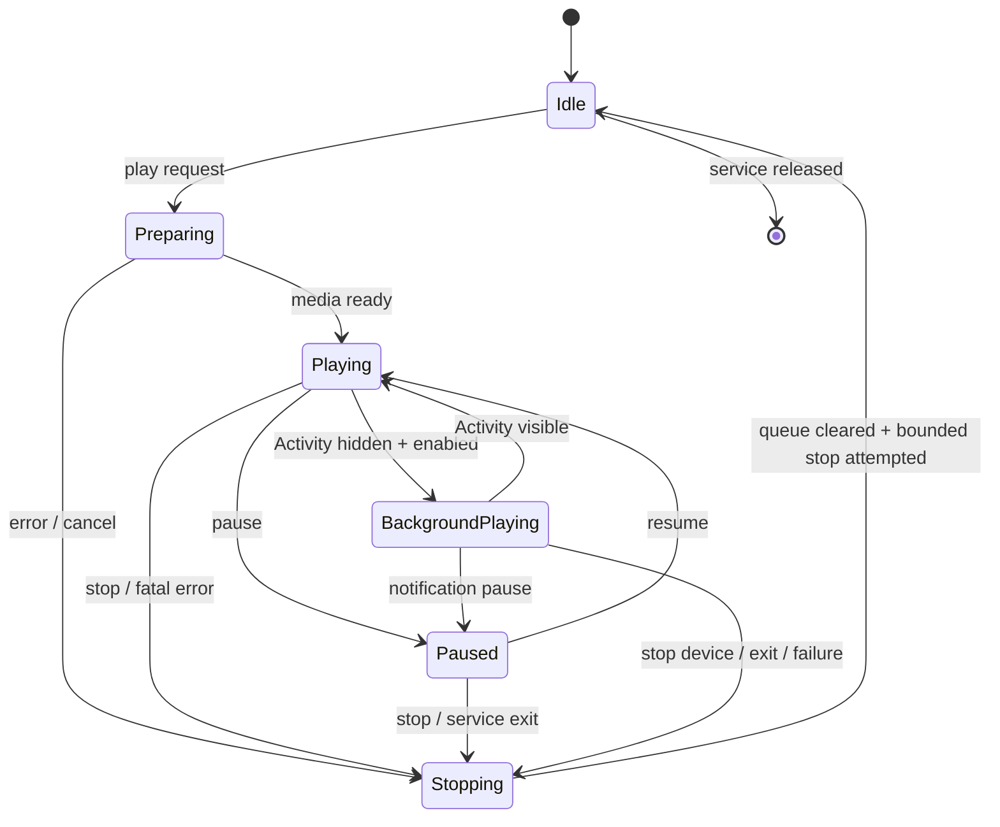

# 后台播放与安全生命周期

## 决策

播放会话由 media playback 类型的 Foreground Service 持有。Activity 绑定服务并渲染状态，但旋转、返回桌面或 UI 进程组件重建不应销毁播放器。只有用户显式开启后台播放后，Activity 不可见时服务才继续媒体和设备输出。

## Android 组件

- `PlaybackService`：前台服务、会话所有者、通知 action 接收者。
- `MediaSession`：系统媒体控制、音频焦点、耳机/蓝牙媒体按键。
- `PlaybackSession`：队列、libmpv、脚本调度和设备安全控制器的组合根。
- `PlaybackNotification`：播放/暂停、停止设备、退出后台三类独立命令。
- `ActivitySessionBinder`：只暴露状态和用户意图，不暴露 native/transport 对象。

计划权限包括 `FOREGROUND_SERVICE`、`FOREGROUND_SERVICE_MEDIA_PLAYBACK`、`POST_NOTIFICATIONS`、`WAKE_LOCK`，以及按 transport 分拆的蓝牙/网络/USB 权限。权限必须按 Android 版本最小化申请。

## 状态机

“停止设备”不会自动退出媒体播放，但会：冻结脚本调度、增加 command generation、清空所有非停止命令并向每个活动连接发送受限停止/归中策略。“退出后台播放”同时停止播放、设备和服务。

## 锁屏运行

- 播放开始且需要锁屏继续时持有 partial wake lock；暂停、停止和无活动设备时立即释放。
- SMB 流或 Wi-Fi TCode transport 需要时可持有高性能 Wi-Fi lock，且必须与会话生命周期绑定。
- 音频焦点丢失时按设置暂停或 duck；脚本默认跟随实际媒体时钟，媒体暂停则脚本停止。
- Surface 消失不等于媒体停止。libmpv 应允许无视频 Surface 的音频/时钟继续；Surface 恢复后重新绑定并 seek 到服务时钟。

## 无法保证回调的终止场景

Android `force-stop`、内核杀进程、断电和 native 崩溃不保证执行 `onDestroy`，因此安全不能只依赖最后一条“停止”命令。

必须同时满足：

1. 不向设备下发无限期的固件端循环；循环由应用逐段生成。
2. 每条运动命令的未来时域有硬上限，默认不超过 500 ms，真实设备调优后只能缩短或由明确安全 ADR 改动。
3. 调度器持续滚动刷新短时目标；应用消失后设备至多完成最后一个短时目标。
4. transport 关闭或 socket 断开时清队列；固件支持 watchdog/timeout 时启用但不把它作为唯一保护。
5. 每个新会话/seek 使用 generation；旧 generation 的晚到命令丢弃。

## 循环与行为事件

- 媒体从尾部跳到开头时记录一次 replay origin。
- 用户主动点重播：`MANUAL`。
- 前台无限循环：`FOREGROUND_AUTO_LOOP`。
- 屏幕关闭或 Activity 不可见时的自动循环：`BACKGROUND_AUTO_LOOP`。
- 完成度来自前台唯一时间区间覆盖，循环计数不增加同一次覆盖率。
- 进入后台前已达到完成阈值可记 completion；后台循环不重复制造 completion。

## 验收矩阵

| 场景 | 媒体 | 脚本 | 设备 | 必须验证 |
| --- | --- | --- | --- | --- |
| 旋转/Activity 重建 | 继续 | 继续 | 继续 | 无双播放器和时间跳变 |
| Home/锁屏且后台开启 | 继续 | 继续 | 继续 | 通知可见、wake lock 有界 |
| Home 且后台关闭 | 暂停 | 停止 | 急停 | 服务不偷偷继续 |
| 通知暂停 | 暂停 | 停止 | 默认急停 | 恢复时重新同步 generation |
| 通知停止设备 | 可继续 | 冻结 | 急停 | 用户显式恢复前不自动重连输出 |
| transport 断开 | 按设置继续 | 可继续计算但不排队 | 急停/短时失效 | 重连不回放旧队列 |
| native 播放错误 | 停止或跳项 | 停止 | 急停 | 错误可见且可恢复 |
| service 销毁 | 停止 | 停止 | 尝试急停 | 释放 wake/Wi-Fi lock |
| force-stop/进程被杀 | 终止 | 终止 | 最后命令短时失效 | 不承诺执行回调 |
