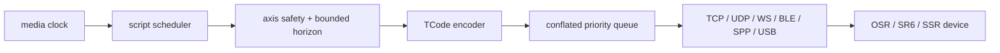

# TCode 设备层

## 分层

`ScriptScheduler` 只生成轴目标；`DeviceSafetyController` 是唯一允许进入编码器的入口；transport 只负责连接和字节收发，不能解释播放状态。

## 协议模型

- 轴使用可扩展的 `AxisId`，不把当前固件轴集合硬编码成不可扩展 enum。
- 内部位置使用规范化 0..100；编码前按轴限制、反转和 TCode 分辨率转换。
- TCode 版本由连接 profile 声明或协商；0.2/0.3/0.4 的编码、轴和拒绝语义见
  `tcode-protocol.md`。
- 参考优先级：`REF_TCODE_FIRMWARE` 当前 fork -> 其上游 TCode 实现 -> 其他播放器的互操作经验。
- 任何来源代码只作语义参考；复制实现必须记录 commit 和许可证。

## 安全流水线

1. 校验轴在连接 profile 白名单中。
2. 拒绝 NaN、负 duration、非单调时间或过期 generation。
3. 将位置钳制到用户轴范围；真实设备测试再额外套安全测试范围。
4. 限制单条命令未来时域，默认最大 500 ms。
5. 按轴合并未发送命令，只保留最新目标，防止延迟积压。
6. 按 transport MTU/帧限制编码并限发送速率。
7. stop 抢占普通命令，增加 generation 并清空队列。

默认停止策略可按 profile 选择保持、归中或发送协议停止，但无论策略如何都必须停止继续排队。真实设备首测默认归中到安全范围中点，用户确认机械结构后才允许更改。

### T08 确定性控制器

`DeviceSafetyController` 由播放会话的同一串行执行上下文调用，不创建线程或读取系统
时钟。`submit()` 按轴合并目标；`drain(wallTimeMs, mediaTimeMs, generation)` 由调用方注入
单调时钟并最多发出一个受速率、命令数和字节预算约束的普通帧。队列只保存 profile
白名单轴，容量有硬上限。

旧 generation 和已经落后于媒体时钟的目标计数后丢弃。新 generation 清空旧队列；
落后的 drain 调用不能提前发送已经提交的未来 generation。
同 generation 的单轴媒体时间必须单调；duration 被限制到 500 ms。目标超过媒体时钟
500 ms、队列溢出、帧无法容纳或 sink 写入异常都会清空队列并进入 stopped 状态。
断连后拒绝新目标，重新连接仍要求调用方以控制器当前 generation 重新采样。

停止优先级高于普通帧并同步写入 sink。连续停止在新目标进入前幂等：只推进一次
generation、只产生一次停止序列。0.3/0.4 可用 `DSTOP` + LF；0.2 不支持该命令，profile
只能选择 HOLD 或按轴安全范围归中。CENTER 按轴 ID 排序，并按同一帧预算分块。

## Transport 契约

每个 transport 统一暴露：

- 可取消的 `connect`、`disconnect`；
- 连接状态和可脱敏诊断；
- 有界的帧发送；
- 断连原因；
- 不包含自动重放业务队列的重连。

重连由上层策略决定。成功重连后必须以新 generation 和当前媒体时钟重新采样，绝不发送断线期间积累的动作。

### T09 网络 transport

`DeviceTransport` 同时实现 `DeviceFrameSink`，公开 `DISCONNECTED`、`CONNECTING`、
`CONNECTED`、`FAILED`、`CLOSED` 状态、待发帧数和不含 host、端口、URL、帧内容的诊断。
状态监听器只接收稳定故障类别；可选接收器交付设备响应字节，用于版本协商，但 transport
不解析或记录 TCode 内容。

TCP、UDP 和 raw WebSocket 共用有界帧队列和单一写线程。普通帧在队列满时立即拒绝；急停帧
清除所有未写普通帧并插入队首。写操作由独立 watchdog 限时，超时或异常后关闭 socket、
清空队列并进入 `FAILED`。`disconnect()` 和 `close()` 同样清队列；重连只创建空队列，不保存
或重放断线期间业务帧。每次连接使用独立 epoch，旧 socket 的迟到 EOF 或写错误不能关闭新连接。
watchdog 为中止阻塞写而关闭连接时，读监视器不把该 EOF 抢报为远端断开；写线程稳定报告
`WRITE_TIMEOUT` 后再结束连接。

Android app 声明普通 `INTERNET` 权限；网络 transport 不申请本地网络扫描、定位或设备权限。

## 各连接方式

### TCP/UDP

- 地址和端口属于用户 connection profile，不写死。
- TCP 有连接/写超时和半开检测；UDP 无“已连接即设备在线”的假设，需要可选探测/最近成功时间。
- 网络切换时旧 socket 失效，重连生成新 generation。
- TCP 读监视检测 EOF；入站字节只交给可选接收器。UDP 使用 connected datagram socket 限定
  对端，每个安全帧对应一个 datagram；`CONNECTED` 只表示本地 socket ready，不声明设备在线。
- 网络切换必须先 `disconnect()` 旧 socket，再显式 `connect()`；transport 不自行重试。

### Raw WebSocket

- 支持固件或 Ayva hub 的原始 TCode 文本/帧桥接。
- 首期不嵌入 JavaScript 引擎，不要求 ayvajs 才能输出 TCode。
- 验证帧大小、协议 scheme 和可选 TLS；禁止在日志中记录带凭据 URL。
- 客户端执行 RFC 6455 upgrade 校验并对所有出站 text frame masking；首期拒绝分片和超限入站帧，
  响应 ping、识别 close/EOF。`wss` 使用平台 trust store 和 HTTPS 主机名校验，不提供跳过证书校验开关。

### BLE

- `TCodeEsp32BleProfile` 固定使用 `REF_TCODE_FIRMWARE` 当前 TCode handler 声明的
  service `ff1b451d-3070-4276-9c81-5dc5ea1043bc`、characteristic
  `c5f1543e-338d-47a0-8525-01e3c621359d` 和 `WRITE_NR`；该 characteristic 未声明
  NOTIFY，因此默认 profile 不强行订阅。通用 `BleDeviceSelector` 仍可为其他固件显式
  配置独立 notify/indicate characteristic 和写类型。
- Android 12+ 分离 `BLUETOOTH_SCAN`/`BLUETOOTH_CONNECT` 运行时权限；API 30 以下扫描
  使用有上限的兼容位置权限。已有用户确认 address 的 profile 直接连接，不无条件扫描；
  扫描同时按 service UUID 和可选 advertised name 过滤。
- 连接阶段串行执行 GATT connect、service discovery、可选 CCCD 订阅和 MTU 协商，全部受
  总连接/操作超时限制且可取消。service/characteristic/写属性/CCCD 缺失、蓝牙关闭、扫描
  失败、权限拒绝、MTU/订阅失败和 GATT 失败均使用稳定故障码，不记录 address、设备名、
  UUID 或 payload。
- 每个业务帧按协商 `MTU - 3` 保序分包；单包失败或超时立即关闭 GATT、清空共享有界队列，
  不重试旧动作。急停仍由共享队列清除未写普通帧并保持 emergency FIFO；显式重连从空队列
  开始，等待上层以新 generation 和当前媒体时钟重新采样。
- manifest 将 BLE feature 声明为可选，并用 `neverForLocation` 声明 Android 12+ 扫描目的；
  无 BLE 设备仍可安装应用。T11 不自动配对、不写系统配对信息、不修改固件配置。

### 经典蓝牙 SPP

- 与 BLE 是两个独立 transport。`SppDiscovery` 只读取系统 `bondedDevices`，可按固件名
  `TCodeESP32` 过滤并返回稳定排序的 address/name 供用户选择；不启动 discovery、不创建
  bond、不弹出自动配对，也不保存或读取系统配对密钥。
- connection profile 必须保存用户确认的蓝牙 address。`SppDeviceTransport` 再次从
  `bondedDevices` 精确匹配该 address，未知或已取消配对的设备以
  `SPP_DEVICE_NOT_PAIRED` 拒绝，绝不回退到“第一个设备”或 `getRemoteDevice()`。
- `TCodeEsp32SppProfile` 使用固件 `BluetoothHandler` 的设备名 `TCodeESP32` 和标准 SPP
  service UUID `00001101-0000-1000-8000-00805f9b34fb`，通过安全 RFCOMM socket 双向传输
  原始 TCode 字节；不依赖 Intiface。
- Android 12+ 枚举已配对设备、读取名称和连接均要求 `BLUETOOTH_CONNECT`；API 30 以下使用
  manifest 中的兼容蓝牙权限。SPP 本身不申请扫描或位置权限。manifest 将经典蓝牙 feature
  声明为可选，无经典蓝牙硬件的设备仍可安装应用。
- RFCOMM connect 在独立 daemon 线程中执行，受 `connectTimeoutMs` 和显式取消限制；超时
  关闭 candidate socket。权限拒绝、蓝牙不可用/关闭、未配对、socket 创建和连接失败使用
  稳定故障码，诊断不记录 address、名称、UUID 或 payload。
- 输入 EOF、读写流异常、蓝牙关闭和 socket 关闭都触发共享队列清空。普通帧有界排队，急停
  清除未写普通帧并保持 emergency FIFO；显式断开、失败和重连不保留或重放业务帧。

### USB 串口

- 使用 Android USB Host 用户授权，不依赖 Android root。`UsbSerialDiscovery` 只报告
  `vendorId/productId/deviceId/portCount`，连接 profile 必须同时包含用户确认的
  `deviceId` 和端口索引；不会按“第一个可用设备”自动连接。
- 串口实现固定使用 `com.github.mik3y:usb-serial-for-android:3.9.0`，上游 tag
  `v3.9.0` 对应 commit `e1018ab31c118b7d2e15fc7c2e9c5b19f33eb1f1`，许可证为 MIT。
  该库仅提供 USB CDC/FTDI/CP210x/CH34x 等驱动，T10 不复制其源码；最终 NOTICE 在
  T32 汇总。
- 默认 profile 为 115200-8-N-1、无流控、100 ms 读超时；`UsbSerialParameters` 可显式
  选择波特率、数据位、停止位、校验、流控和 DTR/RTS。设备不支持某参数时以
  `CONFIGURATION_FAILED` 失败，不静默降级。
- 未获授权时通过一次性动态 action 请求权限，等待受 `connectTimeoutMs` 限制；拒绝、超时、
  设备缺失和驱动不支持分别报告稳定故障码。动态 receiver 使用 `RECEIVER_NOT_EXPORTED`。
- USB detach 广播立即关闭端口和底层 `UsbDeviceConnection`；读写循环清空有界队列并进入
  `FAILED(DEVICE_DETACHED)`。显式断开、失败和重连均不保留或重放业务帧。
- 本模块不包含 ESP32 烧录协议、持久设备配置写入或自动固件更新。

## T13 设备配置 UI

`feature/device` 把界面状态、Android 发现/连接后端和会话协调器分开。Compose 页面只处理
profile 编辑、权限请求和显式用户动作；BLE/SPP/USB 的阻塞发现、六种 transport 的连接以及
受限测试序列都在后台 executor 执行。页面销毁会同步关闭会话，先让安全控制器停止，再断开并
关闭 transport。

发现结果进入 UI 前转换为会话内 opaque id。蓝牙 address 只在 Android 后端的临时 selector
映射中保留，列表只显示后三组 address；诊断只展示稳定故障码、脱敏消息、transport 类型、状态
和待发数量。SPP 入口仍只读取系统已配对的 `TCodeESP32`，不会从 UI 触发扫描或配对。

默认 profile 只启用 `L0`，范围为 40..60，测试幅度为 5%，硬上限为 10% 且同时受当前轴范围
约束。测试动作必须先显示包含轴、范围和幅度的二次确认；确认后只执行低点、高点、中心三个
250 ms 目标，不循环、不写固件配置。测试路径复用 `DeviceSafetyController` 的 TCode 0.3、
CENTER 停止和 transport 急停优先级，断开会取消测试并发送一次受限归中停止序列。

参考播放器对比后的 T13 安全交互如下：

- 采用 Funscript Player 的显式“停止全部动作但保持连接”语义：连接后页头常驻无确认急停按钮，
  直接发送 emergency 优先级的受限归中帧，并取消尚未完成的安全测试；断开仍是独立操作。
- 采用 Syncopathy 的可取消连接语义：`CONNECTING` 状态始终保留断开控制；安全测试进行中也不能
  禁用断开或急停。
- Joytech 的逐轴范围/反转已由 profile 覆盖；逐轴延迟、全局延迟和发送频率属于后续调度设置，
  不在 UI 内绕过 `DeviceSafetyController`。
- Funwisp 的多设备驱动需要扩展当前单 transport 会话所有权，HLS/VR 属于播放阶段；两者均不在
  T13 内用临时 UI 状态模拟。Trymosa 的宽范围手动动作不用于首次真实设备联调，本项目继续保持
  40..60 默认范围和 10% 测试幅度硬上限。

transport 构造或同步连接在 listener 上报前失败时，会话补发稳定的 `CONNECT_FAILED` 和脱敏消息；
若 transport 已经报告终态故障则不重复覆盖。

设备页提供 TCP/UDP/WebSocket 配置、BLE/SPP/USB 发现选择、全部 TCode 0.3 轴的启用/范围/
反转、安全测试和诊断。窄屏 transport 选择器使用两列三行，避免 SPP/USB 隐藏在无提示的横向
滚动区；页面主体为单列滚动，840 dp 以上为连接/诊断与轴/测试双栏；测试截图位于
`docs/qa/t13-screenshots/`，覆盖手机和平板横竖屏及危险动作确认框。

## 首次真实设备联调顺序

1. 编码器 golden tests。
2. loopback transport 和故障注入。
3. OSR 模拟器/录制帧校验。
4. 真实设备连接但不发运动命令。
5. 安全范围内单轴、短 duration、低速测试。
6. 断连/急停验证通过后才测试脚本短片段。

完整命令边界见 `../security/test-device-policy.md`。
