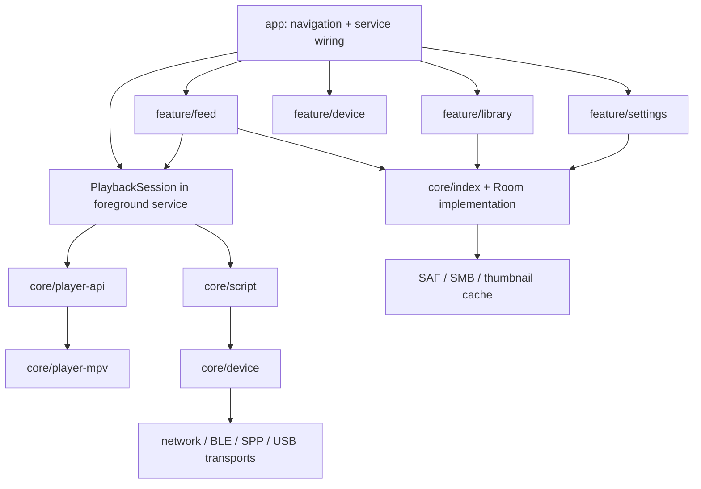

# 总体架构

## 原则

- 播放时钟是脚本同步的唯一主时钟。
- 后台播放服务拥有播放会话，Activity 只是可随时重建的 UI 客户端。
- UI、脚本和扫描层不直接操作具体蓝牙、串口或 socket。
- 设备安全策略位于 transport 之前，任何调用方都不能绕过。
- 数据库是媒体库可见状态的真相来源；文件系统/SMB 扫描结果按 generation 原子提交。
- 相邻上游仓库只作只读参考和可重复 native build 输入，不作为产品源码目录。

## 模块关系

## 运行时所有权

| 资源 | 唯一所有者 | 说明 |
| --- | --- | --- |
| libmpv 实例与 Surface 绑定 | `PlaybackSession` | Surface 可随 Activity 重建，播放器不随之销毁 |
| 当前播放队列和三槽预加载 | `PlaybackSession` | 队列引用物化顺序 generation；旧预加载回调由 token 丢弃，只有当前槽可 play |
| Funscript 调度器 | `PlaybackSession` 子组件 | 读取媒体时钟，只提交目标，不写 transport |
| 高频设备队列 | `DeviceSafetyController` | 有界、可清空、单调序列号 |
| transport 连接 | 对应 `DeviceConnection` | 一个连接只服务一个安全控制器 |
| Room 数据库 | 应用单例 | 扫描、UI、推荐通过 repository 访问 |
| 缩略图缓存 | `ThumbnailRepository` | 数据库记录缓存 key，文件清理由 generation 控制 |

## 主数据流

1. `MediaIndex` 返回已物化的稳定媒体顺序。
2. `PlaybackSession` 保持上一/当前/下一媒体，并向 libmpv 准备当前和邻项。
3. libmpv 的 position/seek/pause/speed/loop 事件更新统一媒体时钟。
4. `ScriptScheduler` 根据媒体时钟和偏移求各轴目标。
5. `DeviceSafetyController` 钳制轴范围、限制时域和速率，再交给 transport。
6. 播放与交互事件异步写入数据库聚合，不阻塞解码或设备调度。
7. 推荐先评分候选，再 MMR 重排和插入探索位，结果也形成带 generation 的顺序。

## 线程与背压

- 主线程只处理 UI、生命周期和轻量状态投影。
- libmpv 回调立即转成内部事件，不在回调中做数据库/网络工作。
- 脚本调度使用单一高优先级协程/线程和单调时钟；seek 通过 generation 丢弃旧命令。
- transport 使用有界 conflated 队列：每轴只保留最新未发送目标，急停具有最高优先级。
- 扫描、元数据和缩略图分别限并发；缩略图永远低于当前媒体准备优先级。

## 扩展边界

- 新设备连接实现 `DeviceTransport`，不能把协议判断写入 UI。
- Intiface/Handy 后续各自作为 adapter 模块，不改变脚本调度契约。
- 推荐算法只消费标准化事件和媒体特征，可替换而不改变媒体索引表。
- libmpv 构建产物由版本化 manifest 描述，播放器 API 不泄漏 native 构建布局。
